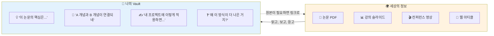
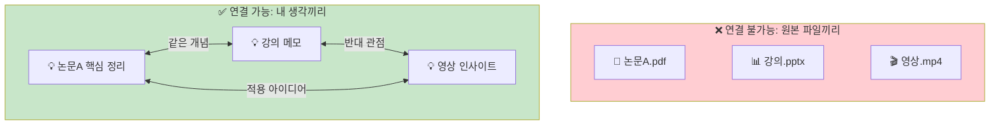
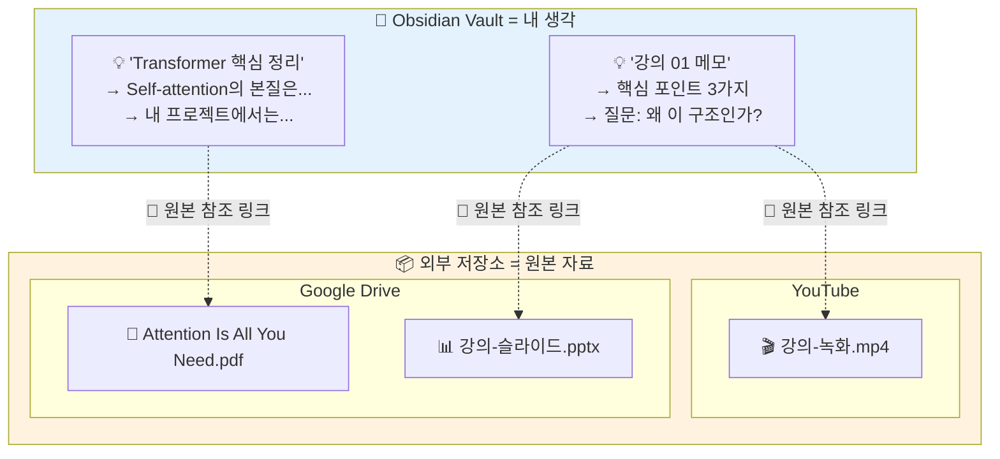
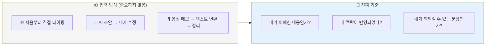
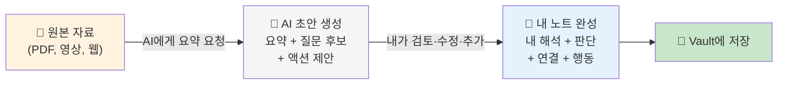

> **시간**: 10:45 - 12:00 (1시간 15분)  
> **목표**: Claude로 선택한 방법론의 Vault 구조 자동 생성

---

## 학습 목표

- **Vault의 본질 이해**: Vault에는 내 생각만, 원본 자료는 외부에
- AI를 활용한 폴더 구조 자동 생성
- 방법론별 템플릿 작성
- 실제 Vault 구축

---

## Vault에는 내 생각만 넣어라

Vault 구조를 만들기 **전에** 반드시 이해해야 할 대원칙이 있습니다.

### Vault는 "내 머릿속"이다

Obsidian Vault의 본질은 **파일 저장소가 아닙니다.** Vault는 **내 생각, 내 아이디어, 내 해석을 담는 공간**입니다.



> **💡 핵심**: 논문 PDF 자체는 "세상의 정보"입니다. 그 논문을 읽고 **"이 부분이 핵심이고, 내 업무에 이렇게 적용할 수 있겠다"**라고 쓴 것이 **"내 생각"**입니다. Vault에 들어가야 하는 것은 후자입니다.

### 왜 원본 자료를 Vault에 넣으면 안 되는가?

이유는 파일 크기가 아닙니다. **그것은 내 생각이 아니기 때문입니다.**

#### 1. 저장 ≠ 이해

PDF를 Vault에 드래그하는 순간, "정리했다"는 착각에 빠집니다. 하지만 **파일을 저장한 것은 지식이 아닙니다.**

```
❌ PDF 저장 후 끝        → 6개월 뒤 열어봐도 뭔 내용인지 모름
✅ 읽고 내 말로 정리     → 6개월 뒤에도 핵심이 바로 보임
```

#### 2. 연결할 수 없는 것은 죽은 정보

Obsidian의 힘은 **노트 간 연결**에 있습니다. PDF, 영상, 슬라이드는 서로 연결되지 않습니다. **내 말로 쓴 노트만이 다른 노트와 연결될 수 있습니다.**



#### 3. AI가 활용할 수 있는 것은 내 글뿐

Opencode는 마크다운 텍스트를 읽고, 분석하고, 연결할 수 있습니다. 하지만 PDF 속 텍스트나 영상 속 내용은 직접 접근하기 어렵습니다.

**내 말로 정리된 노트**가 있어야 AI가:
- 관련 노트를 찾아 연결하고
- 기존 지식 기반으로 새 콘텐츠를 생성하고
- 내 생각의 패턴을 분석할 수 있습니다

### 그러면 원본 자료는 어디에?

원본 자료는 **외부 저장소**에 두고, Vault에서 **링크로 참조**합니다.



| 파일 유형 | 추천 외부 저장소 | Vault에 남기는 것 |
|-----------|-----------------|------------------|
| **PDF (논문, 책)** | Google Drive, Zotero | 핵심 요약 + 내 해석 + 원본 링크 |
| **슬라이드 (PPT)** | Google Drive, OneDrive | 주요 포인트 정리 + 원본 링크 |
| **영상 (MP4)** | YouTube(비공개), Google Drive | 타임스탬프별 메모 + 원본 링크 |
| **대용량 데이터** | NAS, S3 | 데이터 설명 + 분석 결과 + 링크 |

> **💡 이미지는 예외**: 스크린샷, 다이어그램 등 소용량 이미지(수 KB~수 MB)는 Vault 내 `attachments/` 폴더에 두어도 괜찮습니다. 노트 안에서 바로 보여야 이해가 되는 시각 자료이기 때문입니다.

### 실전 예시: 논문을 읽었을 때

```markdown
---
created: 2025-02-05
type: literature
source: "Attention Is All You Need (Vaswani et al., 2017)"
tags: [AI, transformer, attention]
---

# Transformer 핵심 정리

## 내가 이해한 핵심
Self-attention은 시퀀스 내 모든 위치를 동시에 참조한다.
RNN의 순차 처리 한계를 병렬 처리로 극복한 것이 본질.

## 내 프로젝트에 적용하면?
- 로그 분석 시 시퀀스 패턴 탐지에 활용 가능
- 기존 LSTM 기반 모델 대체 검토

## 의문점
- positional encoding 없이는 순서 정보가 사라지는데, 
  이게 정말 최선인가? → [[positional-encoding-연구]] 에서 이어서

## 원본 자료
- 📄 논문: [PDF 원본](https://drive.google.com/file/d/xxx/view)
- 🎬 해설 영상: [YouTube](https://youtu.be/yyy)
```

이렇게 하면:
- ✅ 6개월 후에도 핵심이 바로 보임
- ✅ `[[positional-encoding-연구]]`로 다른 노트와 연결됨
- ✅ AI가 이 내용을 읽고 활용 가능
- ✅ 원본이 필요하면 링크 클릭

### 기술적으로도 좋은 이유

철학이 맞으면 기술적 이점은 자연히 따라옵니다:

| | 내 생각(마크다운) | 원본 파일(바이너리) |
|------|---------|------------------------|
| **동기화** | 수 KB → 즉시 | 수백 MB → 병목 |
| **검색** | Obsidian 전문 검색 | 파일명만 검색 가능 |
| **Git** | 줄 단위 diff 추적 | diff 불가, 매번 전체 저장 |
| **Vault 크기** | 1,000개 노트 ≈ 10 MB | PDF 10개 ≈ 100 MB+ |

> **🎯 한 줄 요약**: Vault는 **서재(원본 보관소)**가 아니라 **두뇌(내 생각)**입니다. 책은 서재에, 그 책에서 얻은 생각은 두뇌에. 두뇌에서 서재로는 링크를 걸면 됩니다.

---

## "내 생각"은 반드시 내가 타자를 쳐야 하나?

앞에서 "Vault에는 내 생각만 넣어라"고 했습니다. 그러면 자연스럽게 이런 의문이 떠오릅니다:

> **"AI가 요약해준 것도 내 생각인가? 아니면 처음부터 끝까지 내가 써야 하나?"**

결론부터: **아닙니다. AI가 쓴 초안을 내가 수정·확정한 것도 내 생각입니다.**

### 핵심 기준: "입력 방식"이 아니라 "최종 책임"



중요한 것은 **누가 첫 글자를 쳤느냐**가 아니라, **최종 결과물을 내가 이해하고, 판단하고, 책임질 수 있느냐**입니다.

### AI 초안이 "내 생각"이 되려면

AI가 만든 문장을 그대로 저장하면, 그건 여전히 "남의 말"입니다. **다음 중 하나라도 추가하면** "내 생각"이 됩니다:

| 내가 추가하는 것 | 예시 |
|-----------------|------|
| **내 말로 재서술** | "결국 이건 ~라는 뜻이다" |
| **내 맥락 연결** | "우리 팀 상황에서는 ~에 해당" |
| **내 판단** | "이 주장에는 동의하지만 ~는 의문" |
| **다른 노트와 연결** | "이건 [[지난주 회의]]에서 나온 ~와 같은 맥락" |
| **다음 행동** | "이걸 바탕으로 ~를 해봐야겠다" |

```
❌ AI 요약 그대로 저장
   → "Transformer는 self-attention 메커니즘을 사용하여..."
   → 6개월 뒤: "이게 왜 여기 있지? 나한테 뭔 의미였지?"

✅ AI 요약 + 내 해석·판단·행동 추가
   → "Transformer의 핵심은 병렬 처리. 우리 로그 분석 파이프라인에서
      LSTM을 대체할 수 있을 듯. 다음 스프린트에서 PoC 해보자."
   → 6개월 뒤: 즉시 맥락 파악 + 다음 행동까지 보임
```

### 권장 워크플로우: AI 초안 → 내가 완성

이 강의에서 권장하는 방식은 **AI가 초안과 질문 후보까지 생성하고, 최종 확정은 내가 하는 것**입니다.



### 권장 노트 구조

AI를 활용하되 "내 생각"을 명확히 분리하는 구조:

```markdown
---
created: 2025-02-05
type: literature
source: "원본 자료 제목"
tags: []
---

# 주제 제목

## AI 요약 (초안)
> (AI가 생성한 요약. 사실/수치는 원본으로 검증 필요)
> - 핵심 포인트 1
> - 핵심 포인트 2
> - 핵심 포인트 3

## 내가 이해한 핵심
(AI 요약을 보고 **내 말로** 다시 정리)

## 내 상황에 적용하면
(내 업무, 프로젝트, 관심사와 연결)

## 질문 / 의문 / 반례
(동의하지 않는 부분, 더 알아볼 것)

## 다음 행동
- [ ] 구체적 액션 아이템

## 연결
- 관련: [[다른-노트]]

## 원본 자료
- 📄 [원본 링크](https://...)
```

> **💡 포인트**: `AI 요약` 섹션은 **인용문(blockquote)**으로 감싸서 "이건 AI가 쓴 것"임을 시각적으로 구분합니다. 그 아래부터가 **진짜 내 생각**입니다.

### AI 활용의 3단계

| 단계 | AI의 역할 | 내가 하는 것 | 노트 품질 |
|------|----------|-------------|----------|
| **1단계**: 요약만 | 원본 자료 요약 | 나머지 전부 직접 작성 | ⭐⭐⭐ |
| **2단계**: 요약 + 질문 후보 | 요약 + "이런 질문을 해볼 수 있다" 제안 | 질문 선별, 내 답변, 적용점 작성 | ⭐⭐⭐ |
| **3단계**: 초안 전체 | 요약 + 적용 아이디어 초안까지 | 검토, 수정, 판단 추가 | ⭐⭐ (검증 필수) |

> **⚠️ 주의**: 3단계로 갈수록 편하지만, **AI가 만든 "내 적용 아이디어"를 그대로 쓰면 실제로는 내 생각이 아닙니다.** 반드시 "이게 맞나?", "우리 상황에서도 통하나?"를 판단하고 수정해야 합니다.

---

## AI로 폴더 구조 생성하기

### 프롬프트 작성법

효과적인 폴더 구조 생성을 위한 프롬프트:

```
다음 조건으로 Obsidian Vault 폴더 구조를 만들어줘:
- 방법론: [PARA / 제텔카스텐]
- 경로: [Vault 경로]
- 추가 요구사항: [있다면 작성]
```

### PARA 구조 생성

<!-- TODO: 실제 명령어 및 결과 예시 -->

### 제텔카스텐 구조 생성

<!-- TODO: 실제 명령어 및 결과 예시 -->

---

## 템플릿 만들기

### PARA 템플릿

#### Project 템플릿
```markdown
---
created: {{date}}
status: active
deadline: 
tags: [project]
---

# {{title}}

## 목표

## 다음 행동

## 관련 자료

## 완료 기준
```

#### Daily Note 템플릿
```markdown
---
created: {{date}}
tags: [daily]
---

# {{date}} 일일 노트

## 오늘 할 일

## 메모

## 회고
```

### 제텔카스텐 템플릿

#### Fleeting Note 템플릿
```markdown
---
created: {{date}}
type: fleeting
tags: []
---

# 순간 메모

## 생각/아이디어

## 출처 (있다면)

## 다음 단계
- [ ] Literature Note로 발전
- [ ] Permanent Note로 발전
- [ ] 삭제
```

#### Literature Note 템플릿
```markdown
---
created: {{date}}
type: literature
source: 
author: 
tags: []
---

# {{title}}

## 요약

## 핵심 내용

## 나의 생각

## 연결된 노트
```

#### Permanent Note 템플릿
```markdown
---
created: {{date}}
type: permanent
tags: []
---

# {{title}}

## 핵심 아이디어
(하나의 아이디어만 작성)

## 설명

## 연결
- 관련 노트: 
- 반대 개념: 
- 상위 개념: 

## 출처
```

---

## 실습: Vault 구조 자동 생성

### 실습 목표
- 선택한 방법론으로 Vault 구조 생성
- 기본 템플릿 생성
- 구조 확인

### 실습 단계

1. **방법론 선택 확인**

2. **AI로 폴더 구조 생성**
   ```bash
   # TODO: 실습 명령어
   ```

3. **템플릿 생성**
   ```bash
   # TODO: 실습 명령어
   ```

4. **구조 확인**

---

## 정리

- [ ] Vault의 본질 이해 완료 (내 생각만 Vault에, 원본 자료는 외부에)
- [ ] Vault 폴더 구조 생성 완료
- [ ] 기본 템플릿 생성 완료
- [ ] Obsidian에서 구조 확인 완료
