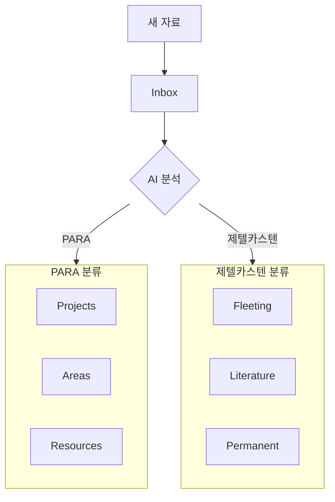

> **시간**: 14:00 - 15:00 (1시간)  
> **목표**: AI를 활용한 지식 캡처 자동화 구축

---

## 학습 목표

- Inbox → 적절한 위치 자동 분류
- 태그/링크 자동 추천 활용
- 웹/PDF 자료 자동 정리

---

## Inbox에서 자동 분류

### 분류 워크플로우



### 분류 프롬프트

```
다음 노트를 분석하고 적절한 위치로 분류해줘:

노트 내용: [내용]

현재 방법론: [PARA / 제텔카스텐]
Vault 경로: [경로]

분류 후 해당 위치로 이동하고, 적절한 태그와 링크를 추가해줘.
```

---

## 태그/링크 자동 추천

### 태그 추천 원리

<!-- TODO: 내용 작성 -->

### 링크 추천 원리

<!-- TODO: 내용 작성 -->

---

## 웹/PDF 자료 자동 정리

### 웹 아티클 → Literature Note

```
이 URL의 내용을 읽고 Literature Note로 정리해줘:
URL: [URL]

다음 형식으로 작성:
- 요약
- 핵심 내용 (bullet points)
- 나의 생각/질문
- 관련 태그
```

### PDF → 요약 노트

<!-- TODO: 내용 작성 -->

---

## 실습: 새 자료 → 정리된 노트 파이프라인

### 실습 목표
- 웹 아티클을 Literature Note로 변환
- 자동 태그/링크 추천 받기
- Inbox → 적절한 폴더 이동

### 실습 단계

1. **웹 아티클 수집**
   ```bash
   # TODO: 실습 명령어
   ```

2. **AI로 Literature Note 생성**
   ```bash
   # TODO: 실습 명령어
   ```

3. **태그/링크 자동 추가**
   ```bash
   # TODO: 실습 명령어
   ```

4. **결과 확인**

---

## 정리

- [ ] 자동 분류 이해 완료
- [ ] 웹 아티클 정리 실습 완료
- [ ] 태그/링크 추천 활용 완료
